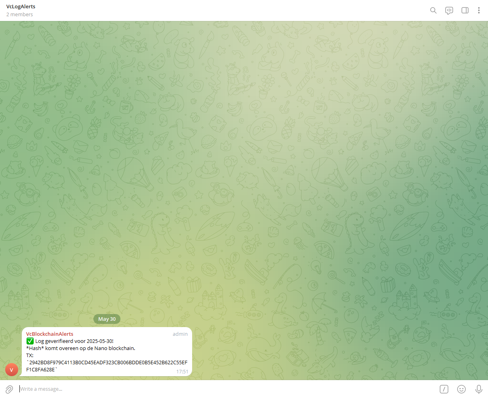
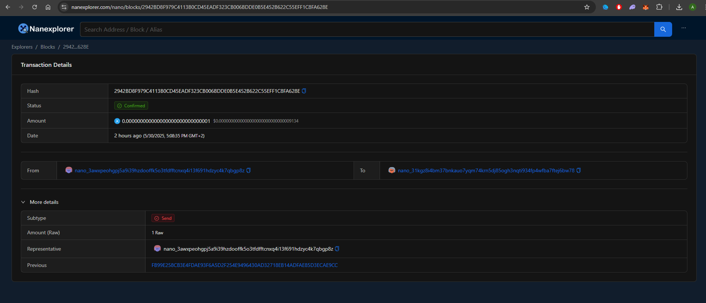

# 📦 Blockchain-Based Logging Integrity for Xen Orchestra

_Graduation project by Arsalan Khosrojerdi – Graduaat Programmeren – PXL Digital_

---

## 🧩 Project Overview

This project integrates **blockchain technology (Nano)** into Xen Orchestra (XO) logging for enhanced integrity and real-time alerting. It anchors daily log hashes on-chain and verifies them with a Telegram bot notification.

---

## 🗂️ Project Files

| File                  | Description                                                  |
|-----------------------|--------------------------------------------------------------|
| `anchor.js`           | Node.js script to anchor log hash on the Nano blockchain     |
| `hashFiles.py`        | Python script to fetch and hash XO backup logs               |
| `verification.py`     | Python script to verify blockchain entry and send Telegram alerts |
| `daily_log_anchor.json` | Auto-generated log hash metadata (excluded from Git)        |
| `nano_tx_proof.json`  | Auto-generated blockchain proof (excluded from Git)          |
| `package.json` / `package-lock.json` | Node.js project dependencies                 |

---

## ⚙️ Setup

### Requirements

- Python 3.9+
- Node.js 18+
- XO API token
- Nano RPC access token
- Telegram bot token + group/chat ID

### Python

```bash
pip install requests
```

### Node.js

```bash
npm install
```

---

## 🚀 Usage

### 1. Generate and hash logs

```bash
python hashFiles.py
```

### 2. Anchor hash on-chain

```bash
node anchor.js
```

### 3. Verify and notify

```bash
python verification.py
```

---

## 🔄 Automation (Linux cron)

```cron
0 3 * * * cd /path/to/project && python3 hashFiles.py && node anchor.js && python3 verification.py
```

---

## 🛡️ Security

- No sensitive log data is stored or exposed.
- Only hashed metadata is anchored on-chain.
- Telegram alerts are configured to notify about hash verification status only.

---

## 🖼️Screenshots

### ✅ Telegram Success


### 📦 Nano Block on nanexplorer


---

## 🔗 Resources

- [Nano RPC Provider](https://rpc.nano.to/)
- [Nault Wallet](https://nault.cc/)
- [Nano Integration Guide](https://docs.nano.org/integration-guides/the-basics/)
- [Nano Representatives](https://nanoticker.org/representatives)
- [nanocurrency-js Library](https://github.com/marvinroger/nanocurrency-js)

---

## 🧑‍💻 Author

**Arsalan Khosrojerdi**  
LinkedIn: [@arsalan-khosrojerdi](https://www.linkedin.com/in/arsalan-khosrojerdi-4a74231ab)  
Company: Virtual Computing – Oisterwijk  
Mentors: Kristof Palmaers, Mohammad Moghtader

---

## 📝 License

This project is licensed under the MIT License.
